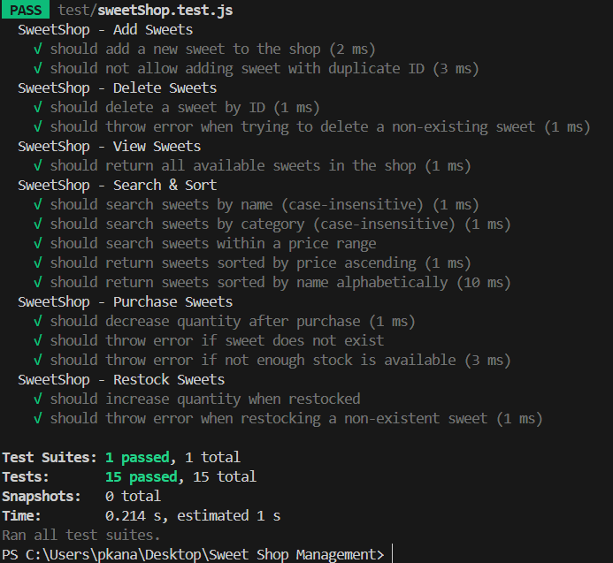
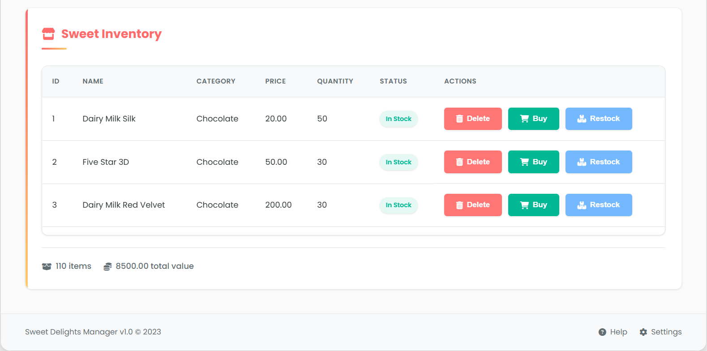

# Incubyte TDD Assessment

A clean, test-driven inventory management system for a sweet shop. Built with modern **JavaScript (ESM modules)**, **Jest** for testing, and a minimal responsive **HTML/CSS frontend**.

---

##  Features

-  Add, View, and Delete Sweets
-  Search by name, category, and price range
-  Sort by name or price
-  Purchase sweets with stock validation
-  Restock sweets
-  Persistent data using `localStorage`
-  Responsive UI using CSS3
-  100% tested backend using **Jest** and **TDD principles**

---

##  Technologies Used

| Tech         | Purpose                    |
|--------------|----------------------------|
| JavaScript   | Core logic (ESM modules)   |
| Jest         | Unit testing (TDD)         |
| HTML/CSS     | Frontend UI (responsive)   |
| localStorage | Client-side persistence    |
| Git          | Version control (TDD logs) |

---

##  What is Test-Driven Development (TDD)?
Test-Driven Development (TDD) is a software development practice where you write tests before writing the actual code.

All business logic isolated in `sweetShop.js`.

Jest tests written for:

- Add / Delete sweets

- View / Search / Sort

- Purchase / Restock operations

---

### Tests

1. **Add a new sweet successfully**

2. **Prevent adding a sweet with duplicate ID**

3. **Delete a sweet by valid ID**

4. **Throw error when deleting a non-existent sweet**

5. **View all available sweets**

6. **Search sweets by name (case-insensitive)**

7. **Search sweets by category (case-insensitive)**

8. **Search sweets by price range (min to max)**

9. **Sort sweets by price in ascending order**

10. **Sort sweets by name alphabetically**

11. **Purchase a sweet and decrease quantity**

12. **Throw error if trying to purchase a non-existent sweet**

13. **Throw error if purchasing more than available quantity**

14. **Restock a sweet and increase quantity**

15. **Throw error when restocking a non-existent sweet**

---

## Regarding Commits
I have ensured to follow TDD methodology throughout the assesment , and in order to showcase that I have made very Frequent commits that helps users to understand `Red -> Green -> Refactor` methodology of adding a failing case, then writing only enough code to pass that single failing case and at last Refactoring. Repeat the process again for each new requirement.
This increases the frequency of the commits but allows other readers to carefully understand the flow of code.

---

### References :
- The Three Laws of TDD - Uncle Bob
- Test-Driven Developement - YouTube, AI & StackOverflow

---

### Test Coverage :

---

### Set Up required for the project:
Install Node.js (if not already installed)
- Download and install from: https://nodejs.org/

Install Jest:
- npm install --save-dev jest

Enable ESM support in `package.json`:
- `"type": "module",
"scripts": {
  "test": "jest"
}
`

Create `jest.config.js`:
- `export default {
  testEnvironment: 'node',
  transform: {},
};
`

---

### Frontend (or UI):

---

## Thank You Incubyte
For giving me an incredible opportunity to explore the field of software development more deeply.